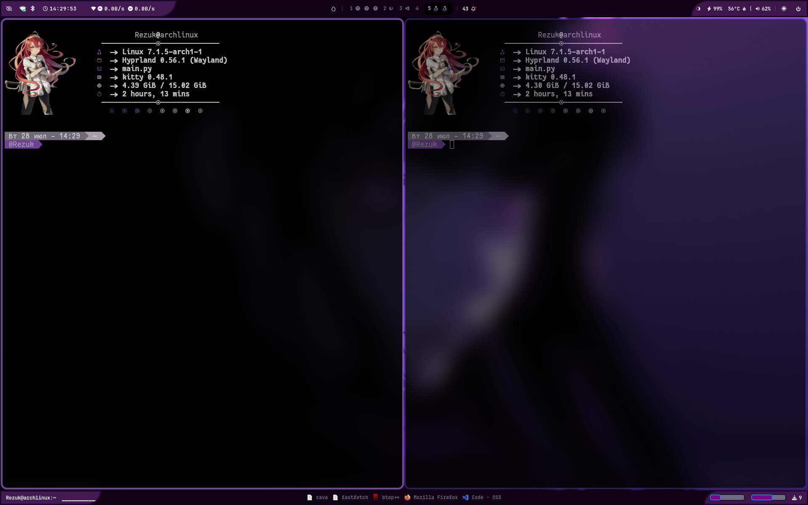
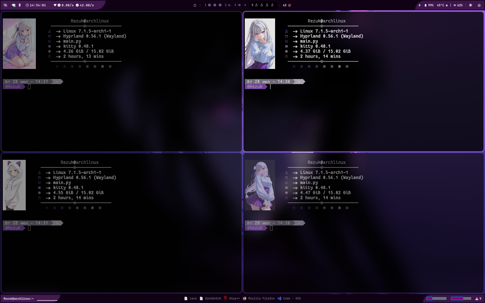
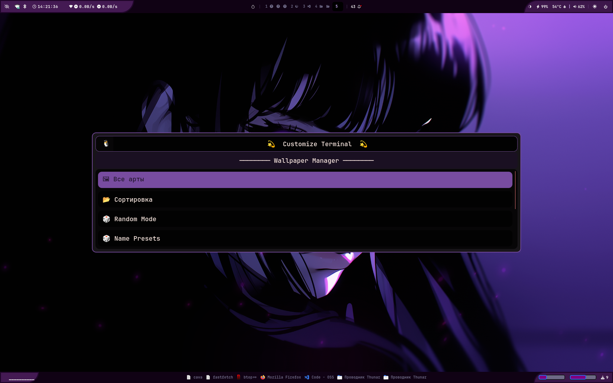
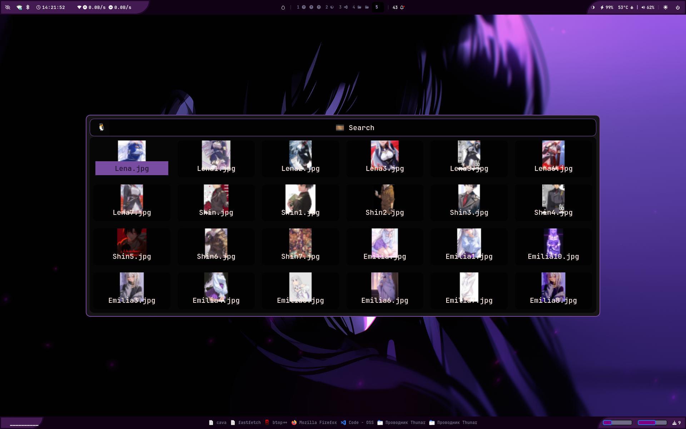

# Anime Terminal Pictures (atp)

**Anime Terminal Pictures (atp)** — это утилита, чтобы украсить свой терминал и сделать свой конфиг более разнообразным. Выводит в терминал аниме картинку с состоянием ос

Уже из коробки собрано более **200 картинок** (преимущественно аниме-вайфу) из популярных аниме-тайтлов такие как: Re:zero, звездное дитя, Мастера меча онлайн, Милый во франксе и много других

Много гипких настроек:
- возможность установить слуйчайный выбор картинки
- установка выбранной картинки
- случайный выбор из выбранного тайтла или своей папки
- случайный выбор по имени персонажа

Конечно же, есть возможность вручную добавлять свои изображения, создавать собственные наборы и полностью менять библиотеку картинок.


> ⚠️ **Важно**
>
> Проект подразумевает использование терминала **Kitty**, так как многие другие терминалы не поддерживают вывод изображений.

---


## Пример






---

## GUI







> Все остальные примеры находятся в папке **screenshots/**.
# Установка

> ⚠️ **Важно**
>
> На данный момент проект необходимо устанавливать **только в домашнюю директорию (`~/terminalPictures`)**.
>
> GUI использует Rofi-темы с фиксированными путями. Если установить проект в другое место, графический интерфейс работать не будет. Пути можно изменить вручную, подробнее об этом написано в **terminalGui/README.md**.

---

## Arch Linux (рекомендуемый способ)

Для Arch Linux предусмотрен автоматический установщик.

```bash
cd ~

git clone https://github.com/Rezuk5/terminalPictures.git

cd terminalPictures

bash skripts/install.sh
```

---
## Другие дистрибутивы Linux

На данный момент прямой поддержки других дистрибутивов нет.

Для работы утилиты необходимо самостоятельно установить следующие зависимости:

- **python** 
- **fastfetch** — используется для вывода изображения и информации о системе;
- **rofi** — используется для графического интерфейса;
- **pipx** — создает отдельное виртуальное окружение и устанавливает команду `atp`.

После установки зависимостей выполните:

```bash
cd ~

git clone https://github.com/Rezuk5/terminalPictures.git

cd terminalPictures

pipx install -e .

atp updateData
```

сделайте .sh исполняемыми

```bash
find terminalGui -type f -name "*.sh" -exec chmod +x {} \;
find skripts -type f -name "*.sh" -exec chmod +x {} \;
```


---

# Использование

## 1) Взаимодействие через GUI

Для открытия графического интерфейса используйте `atp gui`

После запуска будет доступно 4 режима:
### 🖼️ Все арты

Позволяет выбрать статичную картинку. Отображает все изображения из `AnimePictures` и `data/CustomSet`. После выбранная картинка будет выводиться при использовании команды `atp`.

### 📂 Сортировка

Работает так же, как **Все арты**, но сначала предлагает выбрать папку, а затем изображение из нее.

### 🎲 Random Mode
Нужен для установки рандом режима при котором atp каждый раз выводит разные картинки. В нем есть 2 вида раздела:

- 1 Устанавливает AllMod случайную выборку из всех картинок которые лежат в `AnimePictures`  
- 2 Это выбор по названием папок, обычно название тайтлов, устанавливает userMod, при вводе команды atp случайно будут выбираться изображения только из этой папки
- 
### 🎲 Name Presets

Дает выбор папки, выбранная папка отсортируеться по именам. После выбора персонажа `atp` будет случайно выводить только его изображения.
> Чувствителен к случайным именам изображений

# 2) Взаимодействие через команду atp 

| Команда                        | Описание                                                                                                                   |
| ------------------------------ | -------------------------------------------------------------------------------------------------------------------------- |
| `atp`                          | Выводит картинку вместе с информацией о системе. Рекомендую добавить в `.zshrc`, чтобы запускалась при открытии терминала. |
| `atp gui`                      | Открывает графический интерфейс.                                                                                           |
| `atp setPicture "путь"`        | Устанавливает статичную картинку.                                                                                          |
| `atp setAllMod`                | Включает режим случайного выбора из `data/dataPictures.txt`.                                                               |
| `atp setUserMod "папка"`       | Включает случайный выбор изображений из выбранной папки.                                                                   |
| `atp setUserMod "папка" "имя"` | Включает случайный выбор изображений указанного персонажа. Имя определяется по названию файла.                             |
| `atp updateData`               | Обновляет `data/dataPictures.txt` после изменений в `AnimePictures`.                                                       |

---

# Добавление/удаление и взаимодействие с наборами картинок происходит в `AnimePictures` и `data/CustomSet`

## **AnimePictures**
 подразумевает хранение папок с названиями тайтлов аниме или своих сборок. Все фото в этих папках используются в режиме **setAllMod**, то есть могут быть выбраны случайным образом.

## **data/CustomSet**
также хранит папки с фотографиями, но эти фото не могут быть выбраны в режиме **setAllMod**. Здесь можно собирать собственные наборы только из интересующих и красивых фотографий или же по каким-либо определённым параметрам. 

Эти сборки могут использоваться в режиме **setUserMod**, то есть случайным образом будут выбираться фотографии из выбранной папки. 
Подразумевается хранение сборок, в которых фотографии могут быть скопированы из `AnimePictures`, а также хранение фотографий, которые вас мало интересуют, но иногда могут понадобиться.


---

# Об утилите

Cам вывод фото и информации о системе происходит с помощью:
`fastfetch -c configs/fastfetchConfig.jsonc`  В этом конфиге хранится путь к текущему изображению и настройки вывода Fastfetch.


Обнавление data/dataPictures.txt в workData.py
Подробнее — **data/README.md**


Изменение картинок, режимов и тд в skripts/fuctional.py
Подробнее — **skripts/README.md**